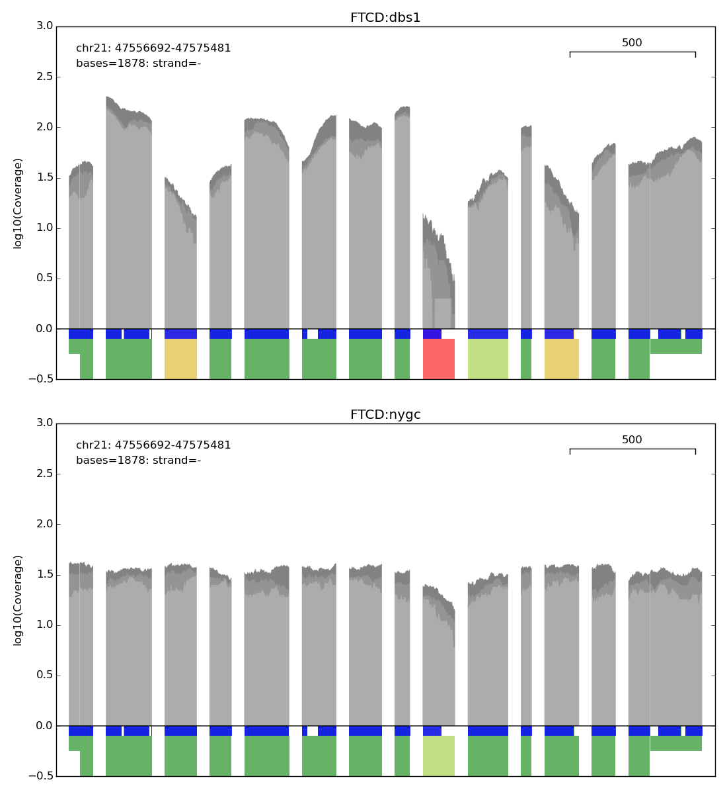

# Read quality and mapping related metrics 


## Dependencies

* python2.7
* python3.7
* numpy
* matplotlib
* pysam 


## Mapping metrics
* unmapped reads
* low quality bases
* read pairs mapped across chromosome
* median insert size
* on target high quality read pairs

```
usage: qc_mapcheck.py [-h] [-n NPROCS] [-b CAPFILE] [-g GENCODE] [-o PREFIX] bamfiles [bamfile..]

	CAPFILE	Exome capture region in bed format
	GENCODE	Gencode gene definition in bed format
	PREFIX	Output file prefix

 e.g. python2.7 metrics/qc_mapcheck.py -b refdata/nimblegen_capture.bed -g refdata/gencode.v19.bed  -o HG01606_test testdata/HG01606_HDAC2.bam
```
#### Output file - important columns:


|    column		       | description                                                 |
| ---------------------------- | ------------------------------------------------------------ |
| sample id                    | sample name - from alignment file name                       |
| reads_uniq                   | reads in file                                                |
| reads_cap                    | reads mapped to the capture region                           |
| bqlt20                       |  bases with base quality < 20                                |
| duplicates                   | duplicate reads (%)                                          |
| unmapped                     | unmapped reads (%)                                           |
| rpdc                         | read pairs mapped to different chromosomes (%)               |
| umhq                         | uniquely mapped properly paired reads with MQ>= 20 (%)       |
| umhq_cap                     | on target uniquely mapped properly paired reads with MQ>=20(%)|
| median_fs                    | median fragment sizes of properly paired reads with MQ>=20   |

## Capture coverage
* median capture coverage
* fraction capture covered at different depths

```
usage: qc_cov.py [-h] [-f BAMFILELIST] [-n NPROCS] [-b BEDFILE] [-q] [-o PREFIX] bamfiles [bamfile..]

        BAMFILELIST alignment files location, one per line (optionally give bamfile names directly as argument)
        BEDFILE Exome capture region in bed format
        -q  Use only properly paired reads with MQ>=20
        PREFIX  Output file prefix

 e.g. python2.7 metrics/qc_cov.py -b refdata/nimblegen_capture.bed -q -o HG01606_test testdata/HG01606_HDAC2.bam
```
#### Output file - important columns:


|    column                    | description                                                 |
| ---------------------------- | ------------------------------------------------------------ |
| sample                       | sample name - from alignment file name                       |
| mean_cov                     | mean coverage over bed region                                |
| med_cov                      | median coverage over bed region                              |
| 1x                           | fraction of bed file covered at 1x depth                     |
| 5x                           | fraction of bed file covered at 5x depth                     |
| ...                          | .......                                                     |
| 45x                          | fraction of bed file covered at 45x depth                     |

## Uniformity of coverage

### step1:
Get base wise coverage of samples


```
usage: basecov.py [-h] [-n CPUS] [-b BEDFILE] [-q MINMQ] [-Q MINBQ] [-o OUTNAME] bamfile [bamfile..]

        BEDFILE Exome capture region in bed format
        MINMQ Minimum mapping quality (default 1)
        MINBQ Minimum base quality (default 1)  Use only properly paired reads with MQ>=20
        OUTNAME Output file name

 e.g. python3.7 metrics/basecov.py -b refdata/nimblegen_capture.bed -q 20 -Q 10 -o HG01606_basecov.tsv testdata/HG01606_HDAC2.bam

```
### step2:
Calculate uniformity of coverage based on base wise coverage files (output files should have suffix basecov.tsv)
```
usage: calc_uniformity.py <folder with base coverage files>

e.g python3.7 metrics/calc_uniformity.py basecov_folder
```
#### Output file - important columns:


|    column                    | description                                                 |
| ---------------------------- | ------------------------------------------------------------ |
| sample                       | sample name - from alignment file name                       |
| mean                         | mean coverage over bed region                                |
| med                          | median coverage over bed region                              |
| perc_mean_fr0.5              | uniformity of coverage as max. deviation from mean coverage in 50% of the base positions|
| iqr_med                      | inter quartile range of coverage depth/median coverage       |


## Gene coverage
```
usage: gcovplot.py [-h] -o OUTPUT -t TXFILE [-g GENES] [-b BEDFILE] [-f FILELIST] 

        OUTPUT Output file name (pdf)
        BEDFILE Exome capture region in bed format
        GENES Gene name file, one per line
        TXFILE  Transcript/exon definition file (refdata/gencode_v19_canonical.tx)
        PREFIX  Output file prefix

 e.g. python2.7 metrics/gcovplot.py -b refdata/nimblegen_capture.bed -t refdata/gencode_v19_canonical.tx -o HG01606_gcov.pdf testdata/HG01606_HDAC2.bam
```
#### Output plot 

Median coverage for 2 different batches of samples (dbs1 and nygc) shown here for the same gene **FTCD**.
Plot of log(base 10) of the median, 20 th percentile and minimum coverage for
each coding exon across all samples for a given sample set. Dark grey: Median coverage,
medium grey: 20 th percentile coverage, light grey: minimum coverage at that position
respectively. Coverage quality of each exon is indicated by colored blocks beneath the exon.
Coverage quality of each exon is indicated by colored blocks beneath the coverage plot. Red:
Greater than 15% of exon has less than 10x median coverage; green: 95% of the exon has
minimum 20x coverage. UTRs that are part of the coding exons have a smaller indicator
thickness. Regions of the exon that overlap with the capture array are indicated in blue just
below the coverage plot. Exon scale in bases is shown in each plot. 
## Inferred sex

```
usage: exome_seq.py [-h] -b BEDFILE -i BAMFILE -o OUTFILE

        BAMFILE Input alignment file
        BEDFILE Exome capture region in bed format
        OUTFILE Output file name (.tsv)

 e.g. python3.6 metrics/exomes_seq.py -b refdata/nimblegen_capture.bed -i testdata/HG01606_HDAC2.bam -o HG01601_inferred_sex.tsv
```
For this script a complete exome file is required. For test data, an exome file from 1000 genomes can be downloaded:

wget ftp://ftp-trace.ncbi.nih.gov/1000genomes/ftp/phase3/data/HG01606/exome_alignment/HG01606.mapped.ILLUMINA.bwa.IBS.exome.20130415.bam
#### Output file - important columns:


|    column                    | description                                                 |
| ---------------------------- | ------------------------------------------------------------ |
| sample                       | sample name - from alignment file name                       |
| Dist_Female                  | distance calculation output for female                       |
| Dist_Male                    | distance calculation output for male                         |
| Sex                          | inferred sex of sample based                                 |

